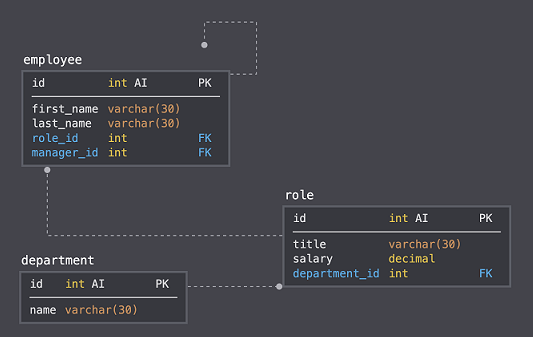

# Employee Tracker

## Description

In this project, I have created a command-line application for managing a company's employees using node, inquirer, and MySQL. The application has the following functionality:

1. View All Employees
2. View All Employees by Manager
3. View All Departments
4. View All Roles
5. Add an Employee
6. Add a Department
7. Add a Role
8. Update Employee Role
9. Update Employee Manager
10. Remove an Employee
11. Remove a Department
12. Remove a Role
13. View Total Utilized Budget of a Department

The database schema is as pictured here:

## Table of Contents

* [Installation](#installation)
* [Usage](#usage)
* [License](#license)
* [Contributing](#contributing)
* [Tests](#tests)
* [Questions](#questions)

## Installation

1. Clone this repo.
2. Install node.js. It can be downloaded here: [node.js Downloads](https://nodejs.org/en/download/)
3. Initialize npm:
    >npm init
4. Install npm inquirer package:
    >npm install inquirer
5. Install npm mysql package:
    >npm insall mysql
6. Install npm console.table package:
    >npm insall console.table --save
7. Install npm figlet:
    >npm install figlet
8. Run the SQL located in /db/employeeTrackerSeeds.sql in MySQL to create the databse and populate the tables.

## Usage

To run this app, open the console in the directory where the start.js file is and run the following command:
>node start

You will select from a menu list as follows:

* View All Employees
* View All Employees by Manager
* View All Departments
* View All Roles
* Add an Employee
* Add a Department
* Add a Role
* Update Employee Role
* Update Employee Manager
* Remove an Employee
* Remove a Department
* Remove a Role
* View Total Utilized Budget of a Department

## License

This application is covered under license: MIT License.

## Contributing

If you would like to contribute to this repository, please contact me via the email below to discuss the changes you wish to make.

## Tests

To test this application:

1. Run the application in your terminal by typing:
    > node start.js
2. Go through each menu item and see that the results are as expected.
3. After adding, updating, or deleting data, verify that your changes are reflected in the employeeTracker MySQL database.

## Questions

### Contact Information

GitHub Profile: [@johannaleal](http://github.com/johannaleal)

Email: <johannarleal@gmail.com>
